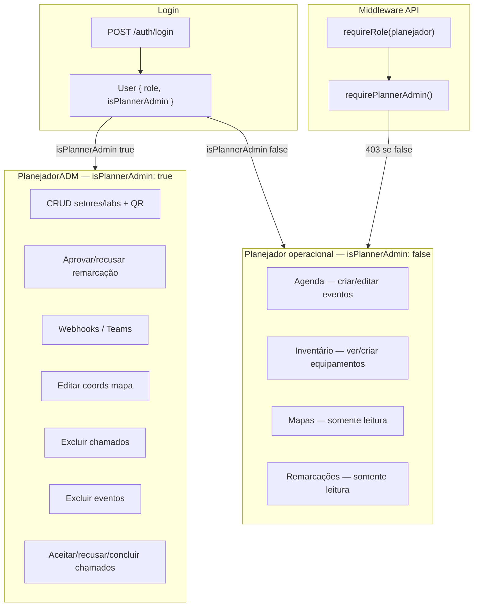

# Guia de Arquitetura — Planejador ADM vs Planejador Operacional (AMU)

Documento para **recriar em outra IA** a hierarquia de permissões entre **PlanejadorADM** (acesso total) e **Planejador operacional** (restrito). Complementa `GUIA-RECRIACAO.md`, `GUIA-FRONTEND.md`, `GUIA-WEBHOOKS.md` e `GUIA-QRCODE.md`.

> Idioma da UI: pt-BR. Sem emojis na interface.

---

## 1. Visão geral

Hoje o sistema possui um único papel `planejador` com **acesso total** a configurações, remarcações, webhooks, mapas, chamados e calendário. Este guia define a divisão em dois níveis dentro do mesmo `UserRole.planejador`:

| Conta | username seed | Nível | Descrição |
|---|---|---|---|
| **PlanejadorADM** | `planejador_adm` | Administrador | Todas as permissões atuais de planejador |
| **Planejador 1** | `planejador_1` | Operacional | Agenda, inventário, mapas (leitura), remarcações (leitura) |
| **Planejador 2** | `planejador_2` | Operacional | Idêntico ao Planejador 1 |

Senha demo para as três contas: `kronus2026`.

---

## 2. Decisão de arquitetura

### Opção recomendada: `role` + flag `isPlannerAdmin`

Manter `UserRole.planejador` para ambos os níveis (nav, agenda, inventário compartilham a mesma role). Diferenciar com campo booleano no banco:

```prisma
model User {
  id              Int      @id @default(autoincrement())
  username        String   @unique
  passwordHash    String   @map("password_hash")
  name            String
  jobTitle        String   @map("job_title")
  role            UserRole
  isPlannerAdmin  Boolean  @default(false) @map("is_planner_admin")
  createdAt       DateTime @default(now()) @map("created_at") @db.Timestamptz(6)
  updatedAt       DateTime @default(now()) @map("updated_at") @db.Timestamptz(6)

  @@map("users")
}
```

**Por que não criar `UserRole.planejador_adm`?**

- Menos mudanças em OpenAPI, Orval, `RoleGate`, `getNavItems` e seeds.
- Nav e layout continuam tratando `role === "planejador"`.
- Restrições ficam centralizadas em `isPlannerAdmin` + middleware `requirePlannerAdmin()`.

**Alternativa descartada:** enum `planejador_adm` separado — exige duplicar checagens em dezenas de pontos (`allow={["planejador", "planejador_adm"]}`).

---

## 3. Diagrama de autorização



---

## 4. Matriz de permissões

### 4.1 PlanejadorADM (acesso total)

Tudo que o `planejador` tem hoje, sem restrições.

### 4.2 Planejador operacional (restrito)

| Área | Permitido | Bloqueado |
|---|---|---|
| **Login / perfil** | sim | — |
| **Agenda** — ver calendário | sim | — |
| **Agenda** — criar/editar evento | sim | — |
| **Agenda** — excluir evento | — | sim |
| **Reagendamento** — ver pendentes | sim (somente leitura) | — |
| **Reagendamento** — aprovar/recusar | — | sim |
| **Reagendamento** — excluir pedido | — | sim |
| **Configurações** — CRUD setores | — | sim |
| **Configurações** — CRUD labs | — | sim |
| **Configurações** — gerar QR / download PNG | — | sim |
| **Mapas (Overview)** — ver | sim | — |
| **Mapas** — arrastar coordenadas do setor | — | sim |
| **Inventário** — ver / filtrar | sim | — |
| **Inventário** — criar equipamento | sim | — |
| **Chamados** — ver / comentar | sim | — |
| **Chamados** — aceitar/recusar/concluir | — | sim (só técnico + ADM) |
| **Chamados** — excluir | — | sim |
| **Teams / Webhooks** — painel completo | — | sim |
| **Teams** — resumo diário on/off / teste | — | sim |
| **Header** — botão Webhook | — | sim |
| **Header** — botão Novo evento | sim | — |
| **Nav** — item Configurações | — | sim (oculto) |

### 4.3 Restrições adicionais importantes (não-ADM)

| Restrição | Motivo |
|---|---|
| Não alterar estrutura organizacional (setores/labs) | Evita mudanças acidentais na hierarquia Cenpes |
| Não decidir remarcações | Decisão de calendário é responsabilidade do ADM |
| Não gerenciar integrações Teams | Webhooks e resumo diário são config sensível |
| Não excluir chamados/eventos | Operações destrutivas só para ADM |
| Não operar fila de chamados | Aceitar/recusar/concluir fica com técnico externo |
| Mapa somente leitura | Posicionamento no mapa é configuração estrutural |
| Sem acesso a `/configuracoes` e `/teams` | Rotas administrativas protegidas no frontend e backend |

---

## 5. Estado atual do código (referência)

Antes da implementação, **todo** `planejador` passa em:

| Arquivo | Rotas / comportamento |
|---|---|
| `routes/configuracoes.ts` | CRUD setores/labs — `requireRole("planejador")` |
| `routes/reschedule-requests.ts` | approve/reject/delete — `requireRole("planejador")` |
| `routes/webhooks.ts` | CRUD webhooks — `requireRole("planejador")` |
| `routes/teams.ts` | settings + daily-summary — `requireRole("planejador")` |
| `routes/setores.ts` | PATCH coords — `requireRole("planejador")` |
| `routes/chamados.ts` | delete — `requireRole("planejador")`; accept/reject/complete — `planejador` ou `tecnico_externo` |
| `routes/calendar.ts` | DELETE events — `requireRole(...allRoles)` (qualquer papel) |
| `components/layout.tsx` | Nav Configurações + botão Webhook para todo `planejador` |
| `App.tsx` | `/configuracoes`, `/teams`, `/overview`, `/reschedules` — `RoleGate allow={["planejador"]}` |
| `lib/roles.ts` | `ROLE_ACCESS_LABEL.planejador = "Acesso total"` |
| `bootstrap.ts` | Usuário `planejador` único |

---

## 6. Backend — middleware e rotas

### 6.1 Novo middleware

Criar `artifacts/api-server/src/middleware/require-planner-admin.ts`:

```typescript
import type { NextFunction, Request, Response } from "express";

export function requirePlannerAdmin() {
  return (req: Request, res: Response, next: NextFunction) => {
    const actor = req.actor;
    if (!actor || actor.role !== "planejador" || !actor.isPlannerAdmin) {
      res.status(403).json({ error: "Operacao restrita ao planejador administrador" });
      return;
    }
    next();
  };
}
```

Estender `resolveActor` / tipo `Actor` para incluir `isPlannerAdmin: boolean` (lookup em `users`).

Combinar middlewares: `requireRole("planejador")` seguido de `requirePlannerAdmin()` nas rotas sensíveis.

### 6.2 Rotas que passam a exigir PlanejadorADM

| Método | Rota | Arquivo |
|---|---|---|
| GET | `/configuracoes/setores` | configuracoes.ts |
| POST | `/configuracoes/setores` | configuracoes.ts |
| PATCH | `/configuracoes/setores/:id` | configuracoes.ts |
| DELETE | `/configuracoes/setores/:id` | configuracoes.ts |
| GET | `/configuracoes/labs` | configuracoes.ts |
| POST | `/configuracoes/labs` | configuracoes.ts |
| PATCH | `/configuracoes/labs/:id` | configuracoes.ts |
| DELETE | `/configuracoes/labs/:id` | configuracoes.ts |
| POST | `/reschedule-requests/:id/approve` | reschedule-requests.ts |
| POST | `/reschedule-requests/:id/reject` | reschedule-requests.ts |
| DELETE | `/reschedule-requests/:id` | reschedule-requests.ts |
| PATCH | `/setores/:id/coords` | setores.ts |
| GET/POST/PATCH/DELETE | `/webhooks/*` | webhooks.ts |
| GET/PATCH/POST | `/teams/*` | teams.ts |
| DELETE | `/chamados/:id` | chamados.ts |
| DELETE | `/calendar/events/:eventId` | calendar.ts |

### 6.3 Rotas que permanecem para qualquer planejador

| Método | Rota | Motivo |
|---|---|---|
| GET | `/reschedule-requests` | Ver pendentes (UI sem botões de ação) |
| GET | `/configuracoes/labs/:id` | Destino do QR scan (todos os papéis) |
| POST/PATCH | `/calendar/events` | Operacional gerencia agenda |
| GET | `/calendar/events` | Leitura |
| GET/POST | `/inventario/*` | Inventário operacional |
| GET | `/setores` | Mapas (leitura) |
| GET | `/chamados/*` | Visualização |
| POST | `/chamados/:id/comments` | Comentários (se permitido hoje) |

### 6.4 Chamados — regra especial

`accept`, `reject`, `complete` em chamados:

- **Permitido:** `tecnico_externo` **ou** `planejador` com `isPlannerAdmin === true`
- **Bloqueado:** planejador operacional

Implementar helper `canActOnChamados(actor)` no backend e espelhar no frontend (`chamados.tsx`).

### 6.5 Calendário — DELETE restrito

Hoje `DELETE /calendar/events/:eventId` aceita qualquer papel autenticado. Restringir a:

- `planejador` com `isPlannerAdmin === true`
- (Opcional) manter cliente excluindo apenas eventos próprios — se não houver ownership, bloquear todos exceto ADM.

---

## 7. Frontend

### 7.1 Tipo `User` estendido

Incluir `isPlannerAdmin: boolean` no response de login e no schema OpenAPI (`User`).

### 7.2 Helpers — `lib/permissions.ts`

```typescript
import type { User } from "@amu/api-zod";

export function isPlannerAdmin(user: User): boolean {
  return user.role === "planejador" && user.isPlannerAdmin === true;
}

export function isPlannerOperational(user: User): boolean {
  return user.role === "planejador" && !user.isPlannerAdmin;
}

export function canManageStructure(user: User): boolean {
  return isPlannerAdmin(user);
}

export function canDecideReschedule(user: User): boolean {
  return isPlannerAdmin(user);
}

export function canManageTeams(user: User): boolean {
  return isPlannerAdmin(user);
}

export function canActOnChamados(user: User): boolean {
  return user.role === "tecnico_externo" || isPlannerAdmin(user);
}

export function canDeleteCalendarEvent(user: User): boolean {
  return isPlannerAdmin(user);
}
```

### 7.3 UI condicional

| Componente | PlanejadorADM | Planejador operacional |
|---|---|---|
| `layout.tsx` — nav "Configurações" | visível | **oculto** |
| `layout.tsx` — botão Webhook (header) | visível | **oculto** |
| `layout.tsx` — badge Reagendamento | contagem pendente | contagem informativa (sem urgência de ação) |
| `App.tsx` — `/configuracoes`, `/teams` | acesso | redirect `/agenda` |
| `reschedules.tsx` — Aprovar/Recusar | visível | **oculto** + banner read-only |
| `event-dialog.tsx` — Excluir | visível | **oculto** |
| `chamados.tsx` — Aceitar/Recusar/Concluir | visível | **oculto** |
| `overview.tsx` — drag coords | habilitado | **readonly** (sem `onCommit`) |
| `configuracoes.tsx` | CRUD completo | rota inacessível |
| `perfil.tsx` — label acesso | "Acesso total" | "Acesso operacional" |

### 7.4 Componente `PlannerAdminGate` (opcional)

Estender `RoleGate` ou criar gate dedicado:

```typescript
type PlannerAdminGateProps = {
  children: ReactNode;
  fallbackTo?: string;
};

// allow se role === planejador && isPlannerAdmin
// senão Redirect fallbackTo (default /agenda)
```

Usar em `/configuracoes` e `/teams`.

### 7.5 Login demo — `pages/login.tsx`

Substituir botão único "Planejador" por três:

| Label | username |
|---|---|
| Planejador ADM | `planejador_adm` |
| Planejador 1 | `planejador_1` |
| Planejador 2 | `planejador_2` |

Manter Cliente e Técnico externo existentes.

### 7.6 Labels de perfil — `lib/roles.ts`

Ajustar `ROLE_ACCESS_LABEL` ou criar função:

```typescript
export function accessLabelForUser(user: User): string {
  if (user.role === "planejador") {
    return user.isPlannerAdmin ? "Acesso total" : "Acesso operacional";
  }
  return ROLE_ACCESS_LABEL[user.role];
}
```

---

## 8. Seeds — `bootstrap.ts`

```typescript
const plannerUsers = [
  {
    username: "planejador_adm",
    name: "Administrador AMU",
    jobTitle: "Planejador ADM",
    role: "planejador" as const,
    isPlannerAdmin: true,
  },
  {
    username: "planejador_1",
    name: "Planejador Operacional 1",
    jobTitle: "Planejador",
    role: "planejador" as const,
    isPlannerAdmin: false,
  },
  {
    username: "planejador_2",
    name: "Planejador Operacional 2",
    jobTitle: "Planejador",
    role: "planejador" as const,
    isPlannerAdmin: false,
  },
];
```

**Migração:** converter usuário legado `planejador` existente para `planejador_adm` com `isPlannerAdmin: true`, ou remover e usar apenas as três contas novas.

Atualizar referências `createdByUsername: "planejador"` nos seeds de equipamentos/chamados para `planejador_adm`.

---

## 9. OpenAPI e contrato

Adicionar ao schema `User`:

```yaml
User:
  type: object
  required: [id, username, name, jobTitle, role, isPlannerAdmin]
  properties:
    id: { type: integer }
    username: { type: string }
    name: { type: string }
    jobTitle: { type: string }
    role: { $ref: '#/components/schemas/UserRole' }
    isPlannerAdmin: { type: boolean }
```

Rodar `pnpm codegen` para regenerar `@amu/api-zod` e `@amu/api-client-react`.

---

## 10. PROMPTS para implementação (ordem)

### Prompt P0 — Schema Prisma e seed

```
No schema Prisma (lib/db/prisma/schema.prisma), adicione em User:
  isPlannerAdmin Boolean @default(false) @map("is_planner_admin")

Rode pnpm db:push.

Atualize openapi.yaml: User.isPlannerAdmin boolean required.
Rode pnpm codegen.

No bootstrap.ts, crie 3 usuários planejador:
- planejador_adm (isPlannerAdmin: true, name "Administrador AMU")
- planejador_1 (isPlannerAdmin: false, name "Planejador Operacional 1")
- planejador_2 (isPlannerAdmin: false, name "Planejador Operacional 2")
Senha kronus2026 para todos.

Remova ou migre o usuário legado "planejador" para planejador_adm.
Login response (POST /auth/login) deve incluir isPlannerAdmin.
resolveActor em require-role.ts deve carregar isPlannerAdmin do banco.
```

### Prompt P1 — Middleware backend

```
Crie middleware/require-planner-admin.ts com requirePlannerAdmin():
- Exige req.actor.role === "planejador" && req.actor.isPlannerAdmin === true
- 403 { error: "Operacao restrita ao planejador administrador" }

Estenda tipo Actor com isPlannerAdmin: boolean.

Aplique requirePlannerAdmin() APÓS requireRole("planejador") em:
- configuracoes.ts: GET/POST/PATCH/DELETE setores e labs (manter GET labs/:id aberto a todos)
- reschedule-requests.ts: POST approve, POST reject, DELETE :id
- setores.ts: PATCH :id/coords
- webhooks.ts: todas as rotas
- teams.ts: todas as rotas
- chamados.ts: DELETE :id
- calendar.ts: DELETE events/:eventId

Em chamados accept/reject/complete: permitir tecnico_externo OU planejador com isPlannerAdmin.
Bloquear planejador operacional com 403.
```

### Prompt P2 — Frontend permissões

```
Crie artifacts/web/src/lib/permissions.ts com:
isPlannerAdmin, isPlannerOperational, canManageStructure, canDecideReschedule,
canManageTeams, canActOnChamados, canDeleteCalendarEvent.

Estenda useAuth/user type com isPlannerAdmin (via @amu/api-zod).

layout.tsx:
- Nav "Configurações" só se isPlannerAdmin(user)
- Botão Webhook header só se isPlannerAdmin(user)
- Badge reagendamento continua para todo planejador (informativo)

App.tsx:
- /configuracoes e /teams: PlannerAdminGate ou RoleGate + checagem isPlannerAdmin
- fallback /agenda

reschedules.tsx:
- Botões Aprovar/Recusar só se canDecideReschedule(user)
- Banner: "Somente administradores podem aprovar ou recusar remarcações."

event-dialog.tsx: botão Excluir só se canDeleteCalendarEvent(user).

chamados.tsx: canActOnChamados(user) para aceitar/recusar/concluir.

overview.tsx: drag/onCommit coords só se isPlannerAdmin(user).

login.tsx: botões demo Planejador ADM, Planejador 1, Planejador 2.

lib/roles.ts: accessLabelForUser() — "Acesso total" vs "Acesso operacional".
perfil.tsx: usar accessLabelForUser(user).
```

### Prompt P3 — OpenAPI, codegen e typecheck

```
Confirme openapi.yaml com User.isPlannerAdmin.
Rode pnpm codegen && pnpm typecheck em todos os pacotes.
Corrija erros de tipo onde User é construído sem isPlannerAdmin.
Garanta verify-seed.ts valida as 3 contas planejador.
```

### Prompt P4 — Testes manuais

```
1. planejador_adm:
   - Acessa /configuracoes, cria/edita setor e lab, gera QR
   - Acessa /teams, gerencia webhooks
   - Aprova e recusa remarcação em /reschedules
   - Arrasta coordenada em /overview
   - Exclui evento no calendário
   - Aceita/recusa chamado
   - Perfil mostra "Acesso total"

2. planejador_1:
   - /configuracoes e /teams redirecionam para /agenda
   - /reschedules mostra pendentes SEM botões Aprovar/Recusar
   - POST /reschedule-requests/:id/approve retorna 403
   - Cria evento na agenda (OK)
   - Cria equipamento no inventário (OK)
   - Mapas: vê setores, NÃO arrasta pontos
   - Header: sem botão Webhook; com Novo evento
   - Perfil mostra "Acesso operacional"

3. planejador_2: mesmo comportamento de planejador_1.

4. tecnico_externo: continua aceitando/recusando chamados normalmente.

5. pnpm typecheck limpo.
```

---

## 11. Fluxo de decisão (resumo visual)

```
                    ┌─────────────────┐
                    │  POST /login    │
                    └────────┬────────┘
                             │
              ┌──────────────┴──────────────┐
              │                             │
     isPlannerAdmin: true          isPlannerAdmin: false
              │                             │
     ┌────────▼────────┐           ┌────────▼────────┐
     │  PlanejadorADM  │           │ Planejador op.  │
     │  Acesso total   │           │ Acesso restrito │
     └────────┬────────┘           └────────┬────────┘
              │                             │
   Config, Teams, QR,              Agenda, Inventário,
   Remarcação (decidir),           Mapas (leitura),
   Mapas (editar),                 Remarcação (ver),
   Excluir eventos/chamados,        Sem Config/Teams
   Webhooks, Chamados (act)
```

---

## 12. Checklist de aceitação

- [ ] Campo `isPlannerAdmin` no Prisma, banco e response de login.
- [ ] OpenAPI + Orval regenerados com `User.isPlannerAdmin`.
- [ ] Seeds: `planejador_adm`, `planejador_1`, `planejador_2` (senha `kronus2026`).
- [ ] Middleware `requirePlannerAdmin()` retorna 403 para operacional.
- [ ] ADM: CRUD setores/labs, QR, webhooks, approve/reject remarcação.
- [ ] Operacional: **não** CRUD setores/labs.
- [ ] Operacional: **não** approve/reject/excluir remarcação.
- [ ] Operacional: **não** acessa `/configuracoes` nem `/teams`.
- [ ] Operacional: **não** gerencia webhooks (botão oculto no header).
- [ ] Operacional: **não** excluir eventos de calendário.
- [ ] Operacional: **não** aceitar/recusar/concluir chamados.
- [ ] Operacional: **não** excluir chamados.
- [ ] Operacional: **não** editar coordenadas no mapa.
- [ ] Operacional: **sim** ver agenda, criar/editar eventos, inventário.
- [ ] Operacional: **sim** ver remarcações pendentes (read-only).
- [ ] UI não exibe botões de ações proibidas.
- [ ] Perfil distingue "Acesso total" vs "Acesso operacional".
- [ ] Login demo com 3 botões planejador.
- [ ] Técnico externo inalterado na fila de chamados.
- [ ] `pnpm typecheck` limpo.

---

## 13. Melhorias opcionais (não implementadas)

| Melhoria | Descrição |
|---|---|
| Auditoria | Log `actorUsername` + ação em operações ADM (CRUD setor, approve remarcação) |
| Permissões granulares | Tabela `permissions[]` em vez de boolean único |
| Delegação temporária | ADM promove operacional a ADM por período |
| Notificação operacional | Operacional recebe alerta Teams quando remarcação pendente (sem poder decidir) |
| CRUD usuários | ADM cria/desativa contas planejador pela UI |
| Escopo por Cenpes | Operacional vê só `cenpes_1` ou `cenpes_2` |