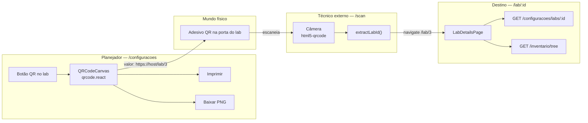

# Guia de QR Code — Scanner, Câmera e Gerador por Laboratório (AMU)

Documento para **recriar em outra IA** a funcionalidade de QR Code do AMU: leitura via câmera (técnico externo), geração por laboratório (planejador) e opções de download/impressão. Complementa `GUIA-RECRIACAO.md`, `GUIA-FRONTEND.md` e `GUIA-WEBHOOKS.md`.

> Idioma da UI: pt-BR. Sem emojis na interface.

---

## 1. Visão geral

O QR Code liga o **mundo físico** (adesivo na porta do lab) ao **sistema digital** (página de detalhes do laboratório).

| Fluxo | Quem usa | O que faz |
|---|---|---|
| **Gerar QR** | Planejador em `/configuracoes` | Cria QR com URL `{origin}/lab/{id}`; imprime ou baixa PNG |
| **Escanear QR** | Técnico externo em `/scan` | Abre câmera, lê QR, navega para `/lab/{id}` |
| **Ver lab** | Qualquer papel autenticado | Página `/lab/:id` com nome, setor e equipamentos |

Não há endpoint backend dedicado a QR — o código é **100% frontend** (bibliotecas `qrcode.react` e `html5-qrcode`). O backend só fornece dados do lab via `GET /api/configuracoes/labs/:id`.

---

## 2. Diagrama de arquitetura



---

## 3. Bibliotecas necessárias

Instalar no pacote `@amu/web`:

```bash
pnpm add html5-qrcode qrcode.react --filter @amu/web
```

| Pacote | Versão | Uso |
|---|---|---|
| `html5-qrcode` | ^2.3.8 | Leitura de QR via câmera (WebRTC / getUserMedia) |
| `qrcode.react` | ^4.2.0 | Renderização de QR Code em `<canvas>` (gerador) |

**Import dinâmico** do scanner (recomendado — reduz bundle inicial):

```typescript
const { Html5Qrcode } = await import("html5-qrcode");
```

**Import estático** do gerador:

```typescript
import { QRCodeCanvas } from "qrcode.react";
```

### Requisitos de ambiente

- **HTTPS ou localhost** — navegadores exigem contexto seguro para `getUserMedia` (câmera).
- Permissão de câmera solicitada automaticamente pelo `html5-qrcode` ao iniciar.
- Em mobile, usar `facingMode: "environment"` (câmera traseira).

---

## 4. Formato do payload do QR Code

O valor codificado no QR é sempre uma **URL absoluta** apontando para a rota frontend do lab:

```
{window.location.origin}/lab/{labId}
```

Exemplos:

```
https://localhost:5173/lab/3
https://amu.exemplo.com/lab/12
```

### Parser na leitura (`extractLabId`)

O scanner aceita **dois formatos**:

1. **URL completa** — regex `/\/lab\/(\d+)/` extrai o id
2. **Número puro** — string só com dígitos (fallback para QR simplificado)

```typescript
function extractLabId(value: string): number | null {
  const match = value.match(/\/lab\/(\d+)/);
  if (match?.[1]) {
    return Number(match[1]);
  }
  if (/^\d+$/.test(value.trim())) {
    return Number(value.trim());
  }
  return null;
}
```

Se `extractLabId` retornar `null` → toast de erro `"QR inválido. Use um código de laboratório."` e **não** navegar.

---

## 5. Scanner de câmera (`pages/scanner.tsx`)

**Rota:** `/scan`  
**Acesso:** apenas `tecnico_externo` (RoleGate em `App.tsx`; item "Scanner" no bottom nav/sidebar substitui "Agenda").

### 5.1 Layout (tela cheia)

- Container: `fixed inset-0 z-30 bg-black` (cobre toda a tela, inclusive layout).
- **Barra superior** (`absolute top-4`, z-40):
    - Esquerda: pill `"Scanner de laboratório"` (`bg-black/60 text-white rounded-xl px-3 py-2`)
    - Direita: botão **"Fechar"** (`variant="outline"`) → navega para `/chamados`
- **Área da câmera:** `<div id="amu-fullscreen-qr" className="h-full w-full" />` — o `html5-qrcode` injeta o vídeo aqui.
- **Loading:** texto `"Iniciando câmera..."` na parte inferior enquanto `!isReady && !errorMessage`.
- **Erro:** cartão branco centralizado com mensagem vermelha `"Não foi possível iniciar a câmera."` + botão **"Voltar"** → `/chamados`.

### 5.2 Configuração do html5-qrcode

```typescript
const scanner = new Html5Qrcode("amu-fullscreen-qr");

await scanner.start(
  { facingMode: "environment" },   // câmera traseira no mobile
  { fps: 10, qrbox: { width: 260, height: 260 } },
  (decodedText) => { /* sucesso */ },
  () => undefined,                 // callback de falha por frame (ignorado)
);
```

| Parâmetro | Valor | Motivo |
|---|---|---|
| `fps` | 10 | Balanceamento performance vs responsividade |
| `qrbox` | 260×260 px | Área de leitura visível centralizada |
| `facingMode` | `environment` | Câmera traseira em dispositivos móveis |

### 5.3 Fluxo ao ler um QR válido

1. Guardar `decodedText` em `lastReadRef` para **evitar leituras duplicadas** consecutivas.
2. Chamar `extractLabId(decodedText)`.
3. Se inválido → `toast.error("QR inválido. Use um código de laboratório.")`.
4. Se válido:
    - `await scanner.stop()` (libera câmera)
    - `navigate(\`/lab/${labId}\`)`

### 5.4 Cleanup (useEffect return)

Ao desmontar o componente:

```typescript
return () => {
  mounted = false;
  void scannerRef.current?.stop().catch(() => undefined);
};
```

Evita vazamento de stream de câmera ao sair da página.

### 5.5 Estados React

| Estado | Tipo | Uso |
|---|---|---|
| `isReady` | boolean | Câmera iniciada com sucesso |
| `errorMessage` | string \| null | Falha ao acessar câmera |
| `scannerRef` | ref Html5Qrcode | Instância para stop no unmount |
| `lastReadRef` | ref string \| null | Anti-duplicata de leitura |

---

## 6. Gerador de QR Code (`pages/configuracoes.tsx`)

**Rota:** `/configuracoes`  
**Acesso:** apenas `planejador` (RoleGate).

Integrado na coluna **Labs** do CRUD de setores/laboratórios.

### 6.1 Botão "QR" em cada lab

Na lista de labs, ao lado de Editar/Excluir:

```tsx
<Button type="button" variant="outline" onClick={() => setQrLabId(lab.id)}>
  QR
</Button>
```

Estado: `qrLabId: number | null` — quando preenchido, exibe o painel de QR abaixo do grid.

### 6.2 Painel de geração

Renderizado condicionalmente quando `qrLabId !== null`:

```tsx
const qrValue = qrLabId ? `${window.location.origin}/lab/${qrLabId}` : "";
```

**Estrutura visual:**

- Cartão `rounded-2xl border bg-card p-4`
- Título: `"QR do Lab #{qrLabId}"`
- Subtítulo: URL completa (`text-sm text-muted-foreground`) — permite copiar manualmente
- Canvas wrapper: `<div id="amu-qr-canvas" className="mt-4 inline-block rounded-2xl border bg-white p-4">`
    - `<QRCodeCanvas value={qrValue} size={220} />`
- Três botões em linha (`flex gap-2`):

| Botão | Variant | Ação |
|---|---|---|
| **Imprimir** | `outline` | `window.print()` — abre diálogo de impressão do navegador |
| **Baixar PNG** | `outline` | Exporta canvas como arquivo `lab-{id}.png` |
| **Fechar** | `default` | `setQrLabId(null)` — oculta painel |

### 6.3 Download PNG (`downloadQrPng`)

```typescript
function downloadQrPng() {
  const canvas = document.querySelector<HTMLCanvasElement>("#amu-qr-canvas canvas");
  if (!canvas) {
    return;
  }
  const a = document.createElement("a");
  a.href = canvas.toDataURL("image/png");
  a.download = `lab-${qrLabId}.png`;
  a.click();
}
```

- Lê o `<canvas>` renderizado pelo `QRCodeCanvas` dentro de `#amu-qr-canvas`.
- Gera data URL PNG e dispara download via elemento `<a>` temporário.
- Nome do arquivo: `lab-3.png`, `lab-12.png`, etc.

### 6.4 Impressão

`window.print()` imprime a página atual. Para melhor resultado em produção, considere adicionar CSS `@media print` que oculte sidebar/header e mostre apenas o cartão do QR (melhoria opcional não implementada hoje).

---

## 7. Página de destino (`pages/lab-details.tsx`)

**Rota:** `/lab/:id` (parâmetro numérico; inválido redireciona para `/agenda`).

**Acesso:** qualquer usuário autenticado (sem RoleGate específico).

### 7.1 Dados carregados

| Query | Endpoint | Dados |
|---|---|---|
| `labQuery` | `GET /configuracoes/labs/:id` | Nome, localização, setor (cenpes) |
| `treeQuery` | `GET /inventario/tree` | Equipamentos do lab (filtrado client-side por `labId`) |

Backend `GET /labs/:id` permite papéis: `planejador`, `cliente`, `tecnico_externo`.

### 7.2 Layout

- **Header:** nome do lab (`text-xl font-semibold`), localização, setor.
- **Seção Equipamentos:** lista com nome + local · gerência; vazio → `"Sem equipamentos cadastrados."`
- **Botão "Ver inventário"** (`outline`) → link `/inventario`
- **Loading:** 2 skeletons
- **Lab inexistente:** `"Lab não encontrado."`

---

## 8. Roteamento e navegação

### 8.1 Rotas (`App.tsx`)

```tsx
<Route path="/scan">
  <RoleGate allow={["tecnico_externo"]} fallbackTo="/agenda">
    <ScannerPage />
  </RoleGate>
</Route>

<Route path="/lab/:id">
  <LabDetailsRoute />  {/* parse id; Redirect se inválido */}
</Route>

<Route path="/configuracoes">
  <RoleGate allow={["planejador"]}>
    <ConfiguracoesPage />
  </RoleGate>
</Route>
```

### 8.2 Navegação por papel (`layout.tsx`)

| Papel | Item de nav | Rota |
|---|---|---|
| `tecnico_externo` | **Scanner** (ícone `Crosshair`) | `/scan` |
| `planejador` | **Configurações** (ícone `Settings2`) | `/configuracoes` |
| `cliente` | — | sem scanner nem configurações |

`homePathByRole`: técnico externo → `/scan`; demais → `/agenda`.

---

## 9. Backend (dependências mínimas)

O QR Code **não exige** rotas novas. Depende do CRUD de labs já existente:

| Método | Rota | Papel | Uso no fluxo QR |
|---|---|---|---|
| `GET` | `/api/configuracoes/labs` | planejador | Listar labs na tela de configurações |
| `GET` | `/api/configuracoes/labs/:id` | todos | Detalhes do lab após escaneamento |
| `GET` | `/api/inventario/tree` | planejador, cliente | Equipamentos na página `/lab/:id` |

Schema Prisma (`Lab`): `id`, `name`, `location`, `idSetor` (FK Setor).

---

## 10. Tratamento de erros e edge cases

| Situação | Comportamento |
|---|---|
| Câmera negada / indisponível | `"Não foi possível iniciar a câmera."` + botão Voltar |
| QR com conteúdo inválido | Toast `"QR inválido. Use um código de laboratório."` |
| Leitura duplicada do mesmo QR | Ignorada via `lastReadRef` |
| Lab id inexistente em `/lab/999` | `"Lab não encontrado."` (404 da API) |
| Usuário não-técnico acessa `/scan` | Redirect para `/agenda` (RoleGate) |
| Download sem canvas | `downloadQrPng` retorna silenciosamente se canvas não existir |
| HTTP (não HTTPS) em produção | Câmera pode falhar — exigir HTTPS |

---

## 11. PROMPTS para recriar a funcionalidade

Use na ordem, após auth, layout e CRUD de labs prontos.

### Prompt Q0 — Dependências

```
No pacote @amu/web, instale html5-qrcode ^2.3.8 e qrcode.react ^4.2.0.
O scanner deve usar import dinâmico de html5-qrcode para code-splitting.
O gerador usa import estático: import { QRCodeCanvas } from "qrcode.react".
Documente que a câmera exige HTTPS ou localhost (getUserMedia).
```

### Prompt Q1 — Parser e contrato do QR

```
Crie a função extractLabId(value: string): number | null em pages/scanner.tsx (ou lib/qr.ts):
- Aceita URL com /lab/{id} via regex
- Aceita número puro (fallback)
- Retorna null se inválido

O valor gerado no QR deve ser sempre: `${window.location.origin}/lab/${labId}`.
```

### Prompt Q2 — Scanner fullscreen (técnico externo)

```
Crie pages/scanner.tsx para rota /scan (só tecnico_externo via RoleGate, fallback /agenda):
- Tela cheia preta fixed inset-0 z-30
- Barra topo: label "Scanner de laboratório" + botão Fechar -> /chamados
- Div id="amu-fullscreen-qr" h-full w-full para html5-qrcode
- Iniciar câmera: facingMode environment, fps 10, qrbox 260x260
- Ao ler QR válido: stop scanner, navigate /lab/{id}
- QR inválido: toast.error "QR inválido. Use um código de laboratório."
- Anti-duplicata com lastReadRef
- Cleanup: scanner.stop() no unmount
- Estados: isReady, errorMessage ("Não foi possível iniciar a câmera." + botão Voltar)
- Loading: "Iniciando câmera..." na parte inferior

No layout.tsx, tecnico_externo vê item "Scanner" (/scan, ícone Crosshair) em vez de Agenda.
homePathByRole: tecnico_externo -> /scan.
```

### Prompt Q3 — Gerador de QR na Configurações (planejador)

```
Em pages/configuracoes.tsx (só planejador), na lista de labs:
- Botão "QR" (outline) em cada lab -> setQrLabId(lab.id)
- Painel condicional quando qrLabId preenchido:
  - Título "QR do Lab #{id}"
  - URL exibida: window.location.origin/lab/{id}
  - QRCodeCanvas value={qrValue} size={220} dentro de div#amu-qr-canvas
    (rounded-2xl border bg-white p-4)
  - Botão "Imprimir" (outline): window.print()
  - Botão "Baixar PNG" (outline): downloadQrPng() lê canvas#amu-qr-canvas canvas,
    toDataURL image/png, download lab-{id}.png
  - Botão "Fechar" (default): setQrLabId(null)
```

### Prompt Q4 — Página de destino do lab

```
Crie pages/lab-details.tsx e rota /lab/:id em App.tsx:
- LabDetailsRoute parseia id numérico; inválido -> Redirect /agenda
- GET /configuracoes/labs/:id (todos os papéis) para nome, location, setor
- GET /inventario/tree para equipamentos do lab (filtrar por labId client-side)
- Header com nome, localização, setor
- Lista equipamentos (nome, local · gerência) ou "Sem equipamentos cadastrados."
- Botão "Ver inventário" (outline) -> /inventario
- Loading: skeletons; 404: "Lab não encontrado."
```

### Prompt Q5 — Integração e testes manuais

```
Registre rotas em App.tsx com RoleGate conforme seção 8.
Garanta GET /configuracoes/labs/:id com requireRole(planejador, cliente, tecnico_externo).

Testes manuais:
1. Planejador: /configuracoes -> QR no lab -> Baixar PNG -> arquivo lab-N.png válido
2. Planejador: Imprimir abre diálogo do navegador
3. Técnico: /scan -> câmera abre -> escanear PNG baixado -> navega /lab/N
4. QR inválido (texto aleatório) -> toast erro, permanece no scanner
5. tecnico_externo home -> /scan; cliente/planejador /scan -> redirect /agenda
6. pnpm typecheck limpo
```

---

## 12. Checklist de aceitação

- [ ] Dependências `html5-qrcode` e `qrcode.react` instaladas em `@amu/web`.
- [ ] QR gerado contém URL `{origin}/lab/{id}`.
- [ ] Planejador clica "QR" em um lab e vê canvas 220×220 com a URL abaixo.
- [ ] **Baixar PNG** gera arquivo `lab-{id}.png` aberto por leitor de QR.
- [ ] **Imprimir** abre diálogo de impressão do navegador.
- [ ] **Fechar** oculta o painel de QR.
- [ ] Técnico externo abre `/scan` e vê preview da câmera (câmera traseira no mobile).
- [ ] Escanear QR válido navega para `/lab/{id}` e libera a câmera.
- [ ] QR inválido mostra toast `"QR inválido. Use um código de laboratório."`.
- [ ] Falha de câmera mostra mensagem de erro e botão Voltar.
- [ ] Página `/lab/:id` exibe dados do lab e equipamentos.
- [ ] Cliente/planejador não acessam `/scan` (redirect).
- [ ] Item "Scanner" aparece só para `tecnico_externo` na nav.
- [ ] `pnpm typecheck` limpo.

---

## 13. Melhorias opcionais (não implementadas)

| Melhoria | Descrição |
|---|---|
| CSS `@media print` | Imprimir só o QR, sem sidebar/header |
| Botão "Copiar URL" | Copiar `qrValue` para clipboard |
| QR em SVG | Export alternativo além de PNG |
| QR na página `/lab/:id` | Técnico visualiza QR do lab atual |
| Download em lote | Gerar ZIP com QR de todos os labs |
| Scanner para planejador | Modo debug escaneando qualquer lab |
| Backend `/labs/:id/qr` | PNG gerado server-side (não necessário hoje) |