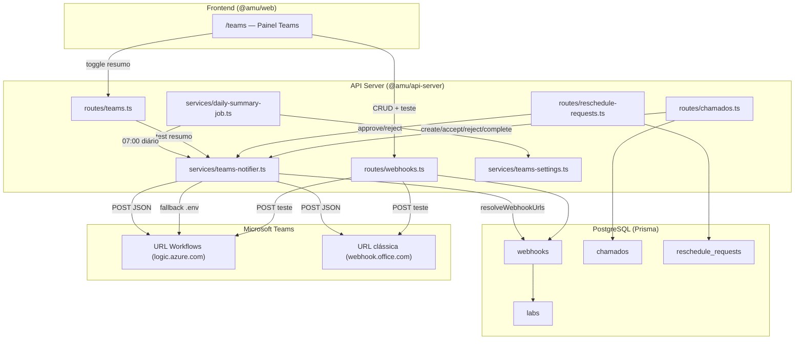

# Guia de Arquitetura — Webhooks Microsoft Teams (AMU / Kronus)

Documento técnico da **integração com Microsoft Teams via webhooks**: modelo de dados, resolução de destinos, formatos de payload, gatilhos de notificação, API, frontend, cron job, variáveis de ambiente e instruções para recriar em outra IA. Complementa `GUIA-RECRIACAO.md` e `GUIA-FRONTEND.md`.

---

## 1. Visão geral

O AMU envia mensagens ao Microsoft Teams quando ocorrem eventos operacionais (chamados, decisões de remarcação, resumo diário). A integração é **unidirecional**: o backend faz `POST` HTTP para uma URL de webhook; o Teams exibe a mensagem no canal configurado.

**Dois tipos de URL suportados:**

| Tipo | Domínio típico | Formato de payload | Status |
|---|---|---|---|
| **Workflows (Power Automate)** | `logic.azure.com`, `powerplatform`, `workflows` | Adaptive Card | Recomendado (não expira) |
| **Connector clássico (Office 365)** | `webhook.office.com` | MessageCard | Depreciado pela Microsoft (403 após revogação) |

O código detecta o tipo pela URL e escolhe o payload automaticamente nas notificações de remarcação e no teste de webhook.

---

## 2. Diagrama de arquitetura



---

## 3. Modelo de dados (Prisma)

Arquivo: `lib/db/prisma/schema.prisma`

```prisma
model Webhook {
   id         Int       @id @default(autoincrement())
   name       String
   url        String
   labId      Int?      @map("lab_id")
   lab        Lab?      @relation(fields: [labId], references: [id])
   enabled    Boolean   @default(true)
   lastSentAt DateTime? @map("last_sent_at") @db.Timestamptz(6)

   @@map("webhooks")
}
```

| Campo | Tipo | Descrição |
|---|---|---|
| `id` | autoincrement | Identificador |
| `name` | string | Nome amigável (ex.: "Canal Lab PQ-101") |
| `url` | string | URL completa do webhook Teams |
| `labId` | int nullable | Se preenchido, webhook **dedicado** ao laboratório; se `null`, webhook **global** |
| `enabled` | boolean | Só webhooks ativos recebem mensagens |
| `lastSentAt` | timestamp nullable | Atualizado apenas no **teste manual** (`POST /webhooks/:id/test`) |

Relação: `Lab` possui `webhooks Webhook[]`. Não há seed automático de webhooks no bootstrap.

---

## 4. Componentes do backend

### 4.1 `routes/webhooks.ts` — CRUD e teste

Montado em `/api/webhooks`. **Apenas planejador** (`requireRole("planejador")`).

| Método | Rota | Ação |
|---|---|---|
| `GET` | `/` | Lista todos os webhooks |
| `POST` | `/` | Cria webhook (`name`, `url`, `labId?`, `enabled?`) |
| `GET` | `/:id` | Obtém um webhook |
| `PATCH` | `/:id` | Atualiza (`name`, `url`, `labId`, `enabled`, `lastSentAt`) |
| `DELETE` | `/:id` | Remove (204) |
| `POST` | `/:id/test` | Envia mensagem de teste ao Teams |

**Validações na criação/edição:**
- `actorUsername`, `name` e `url` obrigatórios no POST.
- Se `labId` informado, o lab deve existir → senão `400 "Laboratorio nao encontrado"`.

**Fluxo do teste (`POST /:id/test`):**
1. Busca o webhook (com `lab.name` se vinculado).
2. Busca eventos do calendário (`listCalendarEvents`) filtrados pelo `labId` do webhook.
3. Usa o **primeiro evento** ordenado por data; se não houver, usa fallback:
   - Equipamento: `"Equipamento de teste"`
   - Data/hora: agora
4. Monta a mensagem no formato padrão AMU:

```
📍 Setor: {lab.name ou "Laboratório não vinculado"}
🔧 Manutenção {Preventiva|Corretiva} - {nome do equipamento}
📅 Data: {dd/mm/aaaa}
🕐 Horário: {HH:mm}
```

5. Detecta tipo de URL (`isWorkflowsUrl`) e monta **Adaptive Card** ou **MessageCard**.
6. Faz `fetch(url, POST, JSON)`.
7. Em erro HTTP → `502` com mensagem orientativa (403/401 = URL revogada; 429 = throttling).
8. Em sucesso → atualiza `lastSentAt` e retorna o webhook.

> O endpoint de teste **não** passa pelo `teams-notifier.ts`; a lógica de payload está duplicada inline em `webhooks.ts`.

### 4.2 `routes/teams.ts` — Configuração do resumo diário

Montado em `/api/teams`. **Apenas planejador**.

| Método | Rota | Ação |
|---|---|---|
| `GET` | `/settings` | Retorna `{ dailySummaryEnabled: boolean }` |
| `PATCH` | `/settings` | Altera `dailySummaryEnabled` (boolean) |
| `POST` | `/daily-summary/test` | Dispara resumo imediato com contagens reais |

> Rotas `/api/teams/*` **não estão** no `openapi.yaml` (sem codegen Orval).

### 4.3 `services/teams-notifier.ts` — Motor de notificações

Centraliza o envio para o Teams. Exporta 3 funções públicas:

| Função | Quando é chamada | Formato de payload |
|---|---|---|
| `sendChamadoNotification` | Criar/aceitar/recusar/concluir chamado | **Sempre Adaptive Card** (`postAdaptiveCard`) |
| `sendRescheduleDecisionNotification` | Aprovar ou recusar remarcação | **Dual**: Adaptive Card (Workflows) ou MessageCard (clássico) |
| `sendDailySummaryNotification` | Cron 07:00 + teste manual | **Sempre Adaptive Card** |

Funções internas:
- `resolveWebhookUrls(labId?)` — resolve para quais URLs enviar (seção 5).
- `isWorkflowsUrl(url)` — regex `/logic\.azure\.com|powerplatform|workflows/i`.
- `postAdaptiveCard(url, payload)` — monta Adaptive Card com `title`, `subtitle`, `facts[]`.
- `postRaw(url, payload)` — envia JSON bruto (usado na remarcação dual-format).
- `formatFullDatePtBr` / `formatHourPtBr` — formatação pt-BR para remarcação.

**Comportamento em erro:** cada URL é tentada em loop; falha em uma URL **não interrompe** as demais. Erros são logados com `logger.error` (pino). A rota HTTP que disparou a notificação **não falha** se o Teams rejeitar (fire-and-forget).

### 4.4 `services/teams-settings.ts` — Flag do resumo diário

Estado **em memória** (não persiste no banco):

```typescript
let dailySummaryEnabled = true;
```

Reinicia para `true` a cada restart do servidor. O planejador liga/desliga via UI.

### 4.5 `services/daily-summary-job.ts` — Cron

- Biblioteca: `node-cron`.
- Expressão: `"0 7 * * *"` (todo dia às 07:00, timezone do servidor).
- Iniciado em `index.ts` via `startDailySummaryJob()` após `bootstrapDatabase()`.
- Só envia se `isDailySummaryEnabled()` for `true`.
- Conta: chamados com `status = "em_espera"` e remarcações com `status = "pendente"`.
- Chama `sendDailySummaryNotification({ chamadosAbertos, remarcacoesPendentes })`.

---

## 5. Resolução de URLs (`resolveWebhookUrls`)

Lógica central em `teams-notifier.ts`. Determina **para quais webhooks** cada notificação é enviada.

```
resolveWebhookUrls(labId?)
│
├─ labId informado?
│   ├─ SIM → busca webhooks WHERE enabled=true AND labId=<id>
│   │         ├─ encontrou? → retorna SÓ essas URLs
│   │         └─ não encontrou? → cai no fallback ↓
│   └─ NÃO → pula direto para fallback
│
├─ FALLBACK 1: busca TODOS os webhooks WHERE enabled=true
│   ├─ encontrou? → retorna TODAS as URLs (broadcast)
│   └─ não encontrou? → cai no fallback ↓
│
└─ FALLBACK 2: variáveis de ambiente
    TEAMS_WEBHOOK_URL + TEAMS_WEBHOOK_URL_2 (se definidas)
```

**Implicações importantes:**

1. **Webhooks globais** (`labId = null`) entram no broadcast do Fallback 1 junto com os dedicados a outros labs.
2. Se um lab **não tem** webhook dedicado, a notificação vai para **todos** os webhooks ativos — não apenas os globais.
3. Se **nenhum** webhook no banco, usa `.env` como último recurso.
4. Webhooks com `enabled = false` são **ignorados** em todas as etapas.

**Quem passa `labId`:**

| Notificação | `labId` usado |
|---|---|
| Chamado | `chamado.labId` |
| Remarcação aprovada/recusada | `rescheduleRequest.labId` |
| Resumo diário | **nenhum** (broadcast ou .env) |
| Teste manual | **não usa** `resolveWebhookUrls` (envia direto para a URL do webhook testado) |

---

## 6. Formatos de payload

### 6.1 Adaptive Card (Workflows — recomendado)

Estrutura base usada por chamados, resumo diário e remarcações (Workflows):

```json
{
  "type": "message",
  "attachments": [{
    "contentType": "application/vnd.microsoft.card.adaptive",
    "content": {
      "$schema": "http://adaptivecards.io/schemas/adaptive-card.json",
      "type": "AdaptiveCard",
      "version": "1.4",
      "body": [ /* TextBlocks, FactSet, Container */ ]
    }
  }]
}
```

**Teste de webhook** (Adaptive Card simples):

```json
{
  "body": [
    { "type": "TextBlock", "text": "AMU", "weight": "Bolder", "size": "Medium" },
    { "type": "TextBlock", "text": "📍 Setor: ...\n🔧 Manutenção ...", "wrap": true }
  ]
}
```

**Remarcação aprovada/recusada** (Adaptive Card com Container colorido):

- Aprovado: `Container` com `style: "good"` (verde).
- Recusado: `Container` com `style: "attention"` (vermelho).
- Blocos: cabeçalho com emoji, subtítulo, setor, tipo de manutenção, motivo, data/horário (se aprovado) ou motivo da recusa.

**Chamado** (Adaptive Card com FactSet):

```json
{
  "title": "Atualizacao de chamado",
  "subtitle": "{descricao}",
  "facts": [
    { "title": "Chamado", "value": "{id}" },
    { "title": "Status", "value": "{status}" },
    { "title": "Solicitante", "value": "{openedBy}" }
  ]
}
```

**Resumo diário** (Adaptive Card com FactSet):

```json
{
  "title": "Resumo diario da manutencao",
  "subtitle": "Atualizacao automatica das 07:00",
  "facts": [
    { "title": "Chamados abertos", "value": "{n}" },
    { "title": "Remarcacoes pendentes", "value": "{n}" }
  ]
}
```

### 6.2 MessageCard (Connector clássico — legado)

Usado apenas quando a URL **não** é Workflows (remarcação e teste):

```json
{
  "@type": "MessageCard",
  "@context": "http://schema.org/extensions",
  "summary": "Remarcação aprovada",
  "themeColor": "2DA44E",
  "title": "✅ Remarcação aprovada",
  "text": "Um pedido de remarcação foi aprovado.\n\n📍 Setor: ..."
}
```

- Aprovado: `themeColor: "2DA44E"` (verde).
- Recusado: `themeColor: "D13438"` (vermelho).
- Teste: `themeColor: "3F7D3A"` (verde AMU), `title: "AMU"`.
- MessageCard exige `\n\n` (dupla quebra) entre linhas; Workflows usa `\n` simples.

### 6.3 Detecção automática de formato

```typescript
function isWorkflowsUrl(url: string): boolean {
  return /logic\.azure\.com|powerplatform|workflows/i.test(url);
}
```

Aplicada em: `sendRescheduleDecisionNotification` e `POST /webhooks/:id/test`.

**Limitação:** `sendChamadoNotification` e `sendDailySummaryNotification` **sempre** enviam Adaptive Card, mesmo para URLs clássicas. Se o webhook for `webhook.office.com`, essas notificações podem falhar silenciosamente (log de erro).

---

## 7. Gatilhos de notificação (eventos → Teams)

| Evento de negócio | Rota que dispara | Função notifier | Envia ao Teams? |
|---|---|---|---|
| Cliente abre chamado | `POST /chamados` | `sendChamadoNotification` | sim |
| Técnico/planejador aceita chamado | `POST /chamados/:id/accept` | `sendChamadoNotification` | sim |
| Técnico/planejador recusa chamado | `POST /chamados/:id/reject` | `sendChamadoNotification` | sim |
| Técnico/planejador conclui chamado | `POST /chamados/:id/complete` | `sendChamadoNotification` | sim |
| Cliente solicita remarcação | `POST /reschedule-requests` | — | **não** |
| Planejador aprova remarcação | `POST /reschedule-requests/:id/approve` | `sendRescheduleDecisionNotification` | sim |
| Planejador recusa remarcação | `POST /reschedule-requests/:id/reject` | `sendRescheduleDecisionNotification` | sim |
| Cron diário (07:00) | `daily-summary-job.ts` | `sendDailySummaryNotification` | sim (se ativo) |
| Teste manual de resumo | `POST /teams/daily-summary/test` | `sendDailySummaryNotification` | sim |
| Teste manual de webhook | `POST /webhooks/:id/test` | inline em `webhooks.ts` | sim |
| Criar/editar evento no calendário | `POST/PATCH /calendar/events` | — | **não** |

---

## 8. API REST (contrato)

### 8.1 Webhooks (`/api/webhooks`) — no OpenAPI

Contrato em `lib/api-spec/openapi.yaml`. Gera hooks Orval/Zod.

**Schema `Webhook`:**

```yaml
id: integer
name: string
url: string
labId: integer | null
enabled: boolean
lastSentAt: date-time | null
```

**`CreateWebhookRequest`:** `actorUsername` + `name` + `url` + `labId?` + `enabled?` (default true).

**`UpdateWebhookRequest`:** campos opcionais (`name`, `url`, `labId`, `enabled`, `lastSentAt`).

Todas as rotas exigem `actorUsername` e papel **planejador**.

### 8.2 Teams (`/api/teams`) — fora do OpenAPI

| Método | Rota | Body | Resposta |
|---|---|---|---|
| `GET` | `/settings` | — | `{ dailySummaryEnabled: boolean }` |
| `PATCH` | `/settings` | `{ actorUsername, dailySummaryEnabled }` | `{ dailySummaryEnabled }` |
| `POST` | `/daily-summary/test` | `{ actorUsername }` | `{ sent: true }` |

### 8.3 Teste de webhook — fora do OpenAPI

| Método | Rota | Body | Resposta |
|---|---|---|---|
| `POST` | `/webhooks/:id/test` | `{ actorUsername }` | Webhook atualizado (com `lastSentAt`) ou `502` com hint |

---

## 9. Frontend — Painel Teams (`/teams`)

Arquivo: `artifacts/web/src/pages/teams.tsx`. Acesso: **planejador** (RoleGate + botão ícone Webhook no header).

### 9.1 Seção "Resumo diário"

- **Botão toggle** "Resumo ativo" / "Resumo inativo": `PATCH /teams/settings`.
- **Botão "Testar resumo"**: `POST /teams/daily-summary/test`.

### 9.2 Seção "Novo webhook"

Form com 3 campos + botão:
- **Nome** (Input, obrigatório)
- **URL webhook** (Input, obrigatório)
- **Laboratório** (select): "Sem laboratorio (global)" ou um lab de `GET /configuracoes/labs`
- **Botão "Adicionar"**: `POST /webhooks` com `{ name, url, enabled: true, labId: number | null }`

### 9.3 Lista de webhooks

Cada cartão exibe: nome, URL, alvo (`Lab #id` ou "Global (todos os labs)").

Três botões por webhook:
- **Ativo/Inativo** (toggle): `PATCH /webhooks/:id { enabled }`
- **Testar disparo**: `POST /webhooks/:id/test` → toast sucesso/erro
- **Excluir** (`destructive`): abre AlertDialog → `DELETE /webhooks/:id`

---

## 10. Variáveis de ambiente

Arquivo: `.env.example`

```env
TEAMS_WEBHOOK_URL=
TEAMS_WEBHOOK_URL_2=
```

Usadas **somente** como fallback em `resolveWebhookUrls` quando não há webhooks cadastrados no banco. Útil para desenvolvimento ou migração gradual para webhooks gerenciados pela UI.

---

## 11. Como gerar uma URL Workflows (recomendado)

O connector clássico (`webhook.office.com`) foi **descontinuado** pela Microsoft e retorna `403 Forbidden` após revogação. Use o app **Workflows (Fluxos)** no Teams:

1. No Microsoft Teams, abra o canal desejado.
2. Clique em **"..."** (Mais opções) → **Workflows** (ou **Fluxos**).
3. Escolha o template **"Post to a channel when a webhook request is received"** (ou equivalente em pt-BR).
4. Dê um nome ao fluxo e selecione o **canal de destino**.
5. Ao finalizar, copie a URL gerada — deve conter `logic.azure.com`.
6. No AMU, acesse **Painel Teams** (`/teams`), cole a URL e vincule ao laboratório desejado (ou deixe global).
7. Clique em **"Testar disparo"** para validar.

A URL Workflows **não expira** por inatividade (diferente do connector clássico).

---

## 12. Tratamento de erros

### 12.1 Teste de webhook (`POST /:id/test`)

| Status Teams | Resposta AMU | Mensagem ao usuário |
|---|---|---|
| 403 / 401 | `502` | "O Teams rejeitou a URL (403/401). A URL provavelmente expirou ou foi revogada. Gere uma nova no Teams pelo app Workflows (Fluxos)..." |
| 429 | `502` | "O Teams limitou os envios (429). Aguarde alguns minutos..." |
| Outros | `502` | "O Teams recusou a mensagem. Verifique a URL do webhook." |
| Erro de rede | `502` | "Erro de rede ao enviar para o Teams" |

Resposta inclui `{ error, status, details }` (details truncado em 500 chars).

### 12.2 Notificações automáticas (notifier)

- Falha silenciosa: log `logger.error` com URL e erro.
- A operação de negócio (aprovar chamado, etc.) **completa com sucesso** mesmo se o Teams falhar.
- Sem retry automático.

---

## 13. Decisões de design e limitações conhecidas

| # | Decisão / limitação | Detalhe |
|---|---|---|
| 1 | Broadcast no fallback | Se um lab não tem webhook dedicado, **todos** os webhooks ativos recebem a mensagem (não só os globais). |
| 2 | Resumo diário sem filtro de lab | `sendDailySummaryNotification` chama `resolveWebhookUrls()` sem `labId` → broadcast. |
| 3 | Settings em memória | `dailySummaryEnabled` não persiste no banco; reinicia `true` ao restart. |
| 4 | Payload dual só na remarcação | Chamados e resumo diário usam **apenas Adaptive Card**; podem falhar em URLs clássicas. |
| 5 | Lógica de teste duplicada | `POST /:id/test` não reutiliza `teams-notifier.ts`. |
| 6 | Sem notificação na criação de remarcação | Só aprovação/recusa disparam Teams; o pedido pendente não notifica. |
| 7 | Sem notificação de calendário | Criar/editar evento no calendário não envia webhook. |
| 8 | `lastSentAt` só no teste | Notificações automáticas não atualizam `lastSentAt`. |
| 9 | Rotas `/teams` e `/test` fora do OpenAPI | Sem codegen; chamadas manuais via `apiPost`/`apiPatch`/`apiGet`. |
| 10 | Emojis nas mensagens Teams | Mensagens de remarcação e teste usam emojis (✅, ❌, 📍, 🔧, 📅, 🕐); a UI do AMU não usa emojis. |

---

## 14. Fluxo completo — exemplo: remarcação aprovada

```
1. Cliente abre /agenda, clica "Solicitar reagendamento" no MaintenanceCard
   → POST /reschedule-requests { eventId, labId, reason, ... }
   → NÃO envia Teams

2. Planejador vê badge na nav, acessa /reschedules
   → Clica "Aprovar", define nova data/hora
   → POST /reschedule-requests/:id/approve { newStart, newEnd }

3. Backend (reschedule-requests.ts):
   a. Transação: SELECT FOR UPDATE, atualiza Google Calendar, marca status=aprovado
   b. Busca evento (summary, maintenanceType) e lab (name)
   c. Chama sendRescheduleDecisionNotification(row, eventTitle, labName, maintenanceType)

4. teams-notifier.ts:
   a. resolveWebhookUrls(labId) → URLs do lab ou fallback
   b. Monta blocks (✅ Remarcação aprovada, setor, manutenção, motivo, data, horário)
   c. Para cada URL:
      - Workflows → Adaptive Card com Container style="good"
      - Clássico → MessageCard themeColor="2DA44E"
   d. POST fetch para cada URL

5. Teams exibe a mensagem no canal configurado
```

---

## 15. PROMPTS para recriar a arquitetura de webhooks

Use após o backend base e o schema Prisma prontos.

### Prompt W0 — Schema e modelo

```
No schema Prisma, crie o model Webhook com id (autoincrement), name (string), url (string),
labId (int nullable, FK para Lab), enabled (boolean default true), lastSentAt (DateTime nullable).
Adicione a relação webhooks Webhook[] em Lab. Mapeie para tabela "webhooks" com snake_case.
```

### Prompt W1 — Serviço teams-notifier

```
Crie artifacts/api-server/src/services/teams-notifier.ts com:
- resolveWebhookUrls(labId?): se labId, busca webhooks enabled com aquele labId; se vazio ou sem labId,
  busca TODOS enabled; se vazio, fallback para TEAMS_WEBHOOK_URL e TEAMS_WEBHOOK_URL_2 do .env.
- isWorkflowsUrl(url): regex logic.azure.com|powerplatform|workflows.
- postAdaptiveCard e postRaw (fetch POST JSON, throw se !ok).
- sendChamadoNotification({ labId, chamadoId, title, status, openedBy }): Adaptive Card com FactSet.
- sendRescheduleDecisionNotification(request, eventTitle, labName, maintenanceType): monta blocks com
  emoji (aprovado verde / recusado vermelho), setor, manutenção, motivo, data/horário; envia Adaptive Card
  (Workflows, Container good/attention) ou MessageCard (clássico, themeColor 2DA44E/D13438).
- sendDailySummaryNotification({ chamadosAbertos, remarcacoesPendentes }): Adaptive Card com FactSet.
Erros por URL: log pino, não interrompe loop. Formatação de datas em pt-BR.
```

### Prompt W2 — Rotas webhooks e teams

```
Crie routes/webhooks.ts montado em /api/webhooks (só planejador):
GET / (lista), POST / (cria, valida labId se informado), GET /:id, PATCH /:id, DELETE /:id (204),
POST /:id/test (envia mensagem de teste no formato AMU com setor/manutenção/data/horário;
detecta Workflows vs MessageCard; fallback "Equipamento de teste" se sem evento; 502 com hints
para 403/401/429; atualiza lastSentAt em sucesso).

Crie routes/teams.ts montado em /api/teams (só planejador):
GET /settings, PATCH /settings (dailySummaryEnabled boolean em memória via teams-settings.ts),
POST /daily-summary/test (conta chamados em_espera e remarcações pendentes, chama sendDailySummaryNotification).

Registre ambos em index.ts. Adicione startDailySummaryJob (cron 0 7 * * *) em index.ts.
```

### Prompt W3 — Integração com rotas de negócio

```
Em routes/chamados.ts, chame sendChamadoNotification após: POST / (criar), POST /:id/accept,
POST /:id/reject, POST /:id/complete. Passe labId do chamado.

Em routes/reschedule-requests.ts, chame sendRescheduleDecisionNotification após:
POST /:id/approve e POST /:id/reject. Passe labId, eventTitle, labName e maintenanceType do evento.
NÃO notifique na criação do pedido (POST /).
```

### Prompt W4 — OpenAPI + frontend

```
Adicione ao openapi.yaml os endpoints /webhooks (CRUD) com schemas Webhook, CreateWebhookRequest,
UpdateWebhookRequest, WebhookListResponse. Rode pnpm codegen.

Crie pages/teams.tsx (Painel Teams, só planejador): seção resumo diário (toggle + testar),
form novo webhook (nome, URL, select lab), lista com toggle ativo/inativo, testar disparo (toast),
excluir (AlertDialog destructive). Botão ícone Webhook no header do layout apontando para /teams.
Rota /teams protegida com RoleGate planejador.
```

### Prompt W5 — Variáveis e documentação operacional

```
Adicione TEAMS_WEBHOOK_URL e TEAMS_WEBHOOK_URL_2 ao .env.example como fallback.
Documente que URLs webhook.office.com (connector clássico) retornam 403 e devem ser substituídas
por URLs logic.azure.com geradas pelo app Workflows no Teams.
```

---

## 16. Checklist de aceitação

- [ ] Planejador cadastra webhook com URL Workflows e lab específico via `/teams`.
- [ ] "Testar disparo" envia mensagem formatada (setor, manutenção, data, horário) e toast de sucesso.
- [ ] URL revogada (`webhook.office.com`) retorna 502 com hint para gerar URL Workflows.
- [ ] Toggle ativo/inativo funciona; webhook inativo não recebe notificações.
- [ ] Excluir webhook remove do banco após confirmação no AlertDialog.
- [ ] Aprovar remarcação dispara notificação Teams no canal do lab (Adaptive Card verde).
- [ ] Recusar remarcação dispara notificação Teams (Adaptive Card vermelho ou MessageCard).
- [ ] Criar chamado dispara notificação Teams (Adaptive Card com FactSet).
- [ ] Resumo diário: toggle liga/desliga; "Testar resumo" envia contagens reais.
- [ ] Cron 07:00 envia resumo quando ativo.
- [ ] Fallback `.env` funciona quando não há webhooks no banco.
- [ ] `pnpm typecheck` limpo.
